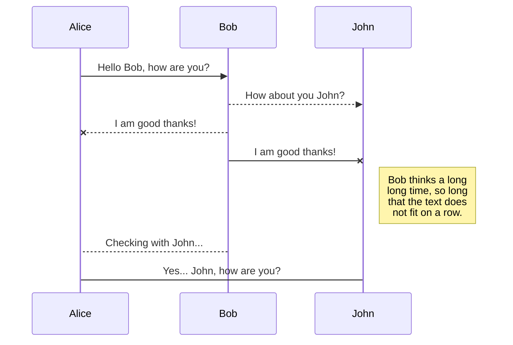
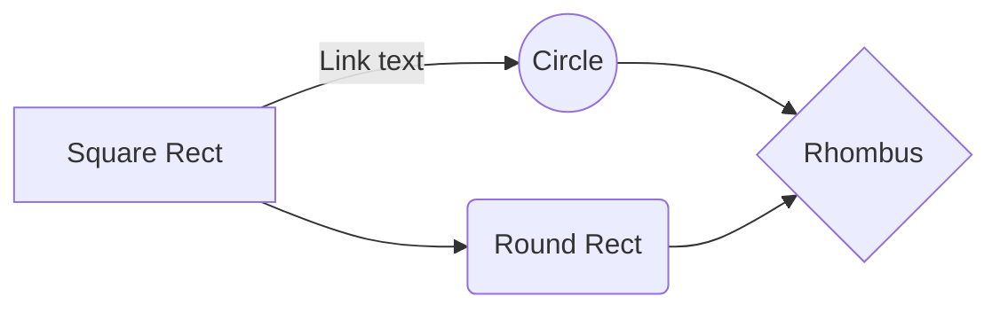

# 42sh!

Grade [??](https://scontent-cdg2-1.xx.fbcdn.net/v/t1.0-0/p370x247/20258415_1390623461036699_1748591071668363730_n.jpg?_nc_cat=0&oh=5e800d5bebf143ed2d89e3a71de51598&oe=5B9261DD)/20

# What is it ?

The **42sh** is our end of first year project at **Epitech**. We have to reproduce a shell based on tcsh with redirections, pipes, separators and environment

# Bonuses

After reproducing the minimal requirements we had carte blanche to have fun and implement new features (some basics of them are strongly suggested)

Here is what we implemented:

- Aliases.
	> alias name=alias
        > alias rm name

- D'autres trucs mais flemme d'écrire.
	> En tout cas le markdown c'est vachement op.

## SmartyPants

SmartyPants converts ASCII punctuation characters into "smart" typographic punctuation HTML entities. For example:

|                |ASCII                          |HTML                         |
|----------------|-------------------------------|-----------------------------|
|Single backticks|`'Isn't this fun?'`            |'Isn't this fun?'            |
|Quotes          |`"Isn't this fun?"`            |"Isn't this fun?"            |
|Dashes          |`-- is en-dash, --- is em-dash`|-- is en-dash, --- is em-dash|

## KaTeX

You can render LaTeX mathematical expressions using [KaTeX](https://khan.github.io/KaTeX/):

The *Gamma function* satisfying $\Gamma(n) = (n-1)!\quad\forall n\in\mathbb N$ is via the Euler integral

$$
\Gamma(z) = \int_0^\infty t^{z-1}e^{-t}dt\,.
$$

> You can find more information about **LaTeX** mathematical expressions [here](http://meta.math.stackexchange.com/questions/5020/mathjax-basic-tutorial-and-quick-reference).

## UML diagrams

You can render UML diagrams using [Mermaid](https://mermaidjs.github.io/). For example, this will produce a sequence diagram:

And this will produce a flow chart:

> **Important:** No CPU was abused during the development of this project.